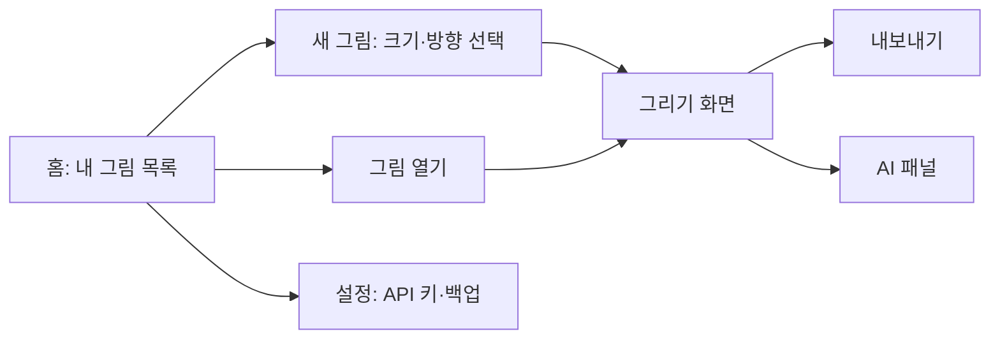

# 그림 그리기 앱 PRD

## 1. 개요와 목표

이 앱은 처음에는 본인이 쓰고 이후 구글 플레이 스토어로 다른 사용자에게도 배포할 그림 그리기 앱으로, 수십 가지 도구와 자유로운 색·두께·용지 크기를 제공하고, 마우스와 터치로 그리며, 구글 제미나이(무료)로 AI 도움을 받을 수 있다. 앱처럼 설치해 쓸 수 있고, 새로고침해도 그림이 사라지지 않는다.

**목표**

- 마우스, 손가락, 스타일러스 어느 쪽으로든 끊김 없이 그릴 수 있다.
- 수십 가지 도구와 무제한에 가까운 색·두께 선택으로 원하는 표현을 할 수 있다.
- A4, B2 같은 표준 용지 크기나 직접 입력한 크기로 캔버스를 만들 수 있다.
- 새로고침, 탭 닫기, 브라우저 재시작 뒤에도 작업 중인 그림이 그대로 남는다.
- 제미나이 무료 API로 그림 아이디어, 색 추천, 이미지 설명 같은 AI 기능을 쓴다.

**비목표 (1차 버전에서 하지 않는 것)**

- 여러 사람이 함께 그리는 실시간 협업, 로그인, 계정, 클라우드 동기화
- 유료 결제와 광고, iOS 앱스토어 배포 (구글 플레이 배포는 9장에서 다룸)
- 포토샵 수준의 RAW 편집, 색상 프로파일(CMYK) 인쇄 관리

## 2. 사용자와 사용 시나리오

사용자는 본인과, 스토어에서 앱을 내려받아 쓰는 일반 사용자이며, 취미로 그림을 그리거나 아이디어를 스케치하는 사람을 가정한다. PC(마우스)와 태블릿·스마트폰(터치)에서 모두 쓴다.

| 상황 | 사용자가 하는 일 | 앱이 해야 하는 일 |
| --- | --- | --- |
| 새 그림 시작 | 용지 크기(A4, B2 등)와 방향, 배경색 선택 | 빈 캔버스를 즉시 만들고 자동 저장 시작 |
| 그리기 | 도구·색·두께를 바꿔 가며 마우스나 손가락으로 그림 | 입력 지연 없이 선을 그리고 되돌리기를 지원 |
| 실수했을 때 | 되돌리기/다시하기, 지우개, 레이어 사용 | 수백 단계까지 되돌리기 기록 유지 |
| 아이디어가 막혔을 때 | AI에게 그릴 주제·색 조합·구도를 묻기 | 제미나이로 제안을 받아 화면에 표시 |
| 중단했다 다시 돌아올 때 | 탭을 닫았다 다시 열거나 새로고침 | 마지막 상태 그대로(레이어, 도구, 색, 확대 위치 포함) 복원 |
| 끝냈을 때 | 이미지 파일로 내보내기 | PNG, JPG, PDF로 내보내기 |

## 3. 핵심 기능 요구사항

우선순위는 P0(1차 출시에 반드시), P1(이후 버전에 추가), P2(여유가 있을 때)로 나눈다.

| 번호 | 기능 | 요구사항 | 우선순위 |
| --- | --- | --- | --- |
| F1 | 그리기 도구 | 수십 가지 도구를 카테고리별로 제공(4장 참고). 첫 출시에는 핵심 20여 가지, 이후 40여 가지로 확장 | P0 |
| F2 | 색상 선택 | 색상 휠/스펙트럼, HEX·RGB 입력, 스포이드(스포이트) 색 추출, 최근 사용한 색, 사용자 팔레트 저장, 투명도 조절 | P0 |
| F3 | 두께 선택 | 슬라이더로 1~200px 조절, 미리보기 원 표시, 도구별 마지막 두께 기억 | P0 |
| F4 | 캔버스 크기 | A0~A6, B0~B6 등 표준 용지 프리셋, 가로/세로 방향, 직접 입력(mm/px), 해상도(DPI) 선택(기본 150, 최대 300) | P0 |
| F5 | 입력 방식 | 마우스, 터치, 스타일러스 모두 지원(Pointer Events). 포인터 압력이 있으면 필압에 따라 두께 변화. 두 손가락으로 확대/축소/이동, 손바닥 오인식 방지 | P0 |
| F6 | 되돌리기/다시하기 | 최소 100단계, 단축키(Ctrl+Z, Ctrl+Shift+Z), 화면 버튼 | P0 |
| F7 | 레이어 | 추가·삭제·순서 변경·보이기/숨기기·불투명도·잠금, 최대 30개 | P1 |
| F8 | 확대/축소/회전 | 10%~800% 확대, 화면 회전, 맞춤 보기 | P0 |
| F9 | 선택·변형 | 사각/올가미 선택 후 이동·크기·회전, 복사/오려내기/붙여넣기 | P1 |
| F10 | 내보내기/불러오기 | PNG, JPG, PDF 내보내기, 이미지 불러와 배경으로 사용, 앱 자체 파일(.draw) 저장·불러오기 | P0 (PNG), P1 (나머지) |
| F11 | 다크/라이트 테마 | 시스템 설정을 따라 키고 수동 전환도 가능 | P2 |

## 4. 도구 목록 (총 50가지)

도구는 여섯 카테고리로 묶어 한 화면에서 바로 찾을 수 있게 한다. 표의 도구는 출발점이며, 개발 중 조정할 수 있다.

| 카테고리 | 도구 | 수 |
| --- | --- | --- |
| 펜/연필류 | 연필, 볼펜, 리노펜(떨림 방지), 만년필, 붓펜(필압 반응), 캘리그라피펜, 형광펜, 사인펜, 색연필, 스케치 연필(HB) | 10 |
| 붓/회화류 | 수채 붓, 유화 붓, 파스텔, 크레용, 목탄, 에어브러시(스프레이), 마커, 번짐 도구(손가락), 수묵 붓, 텍스처 붓 | 10 |
| 도형/선 | 직선, 사각형, 원/타원, 다각형, 별, 화살표, 곡선(베지에), 점선/실선 옵션, 자(눈금 자), 가이드 그리드 | 10 |
| 채우기/색 | 페인트 통(채우기), 그라데이션 채우기, 패턴 채우기, 스포이드, 색 바꾸기, 색 번짐 보정 | 6 |
| 지우기/편집 | 지우개(둥근/네모), 색 지우개, 블러, 선명하게, 리터치 손가락, 물 번짐 | 6 |
| 선택/보조 | 사각 선택, 올가미 선택, 마술봉 선택, 이동, 텍스트 입력, 스티커/도장, 대칭(미러) 그리기, 손 도구(화면 이동) | 8 |

합계는 10 + 10 + 10 + 6 + 6 + 8 = 50가지다. 각 도구는 크기·불투명도·부드러움 같은 옵션 중 해당하는 것만 보여준다.

## 5. AI 기능 (구글 제미나이 무료)

AI는 선택 기능이다. 사용자가 자기 구글 AI Studio API 키를 설정에 한 번 넣으면 켜지고, 키가 없으면 그리기 기능은 정상으로 동작한다. 키는 이 기기의 브라우저 저장소에만 둘 뿐 다른 곳으로 보내지 않는다(제미나이 호출 제외).

다른 사용자에게 배포하면 개발자의 API 키 하나를 모든 사용자가 나눠 쓰게 되어 무료 한도가 금방 찬다. 그래서 1차 배포에서는 각 사용자가 자기 키를 넣는 방식을 기본으로 하고, 서버 중계는 9장에서 다룬다.

| 번호 | AI 기능 | 동작 | 우선순위 |
| --- | --- | --- | --- |
| A1 | 그림 아이디어 추천 | 주제를 입력하면 그릴 거리와 구도를 텍스트로 제안 | P0 |
| A2 | 색 조합 추천 | 분위기를 설명하면 HEX 색 팔레트를 만들어 팔레트에 바로 추가 | P0 |
| A3 | 그림 피드백 | 현재 캔버스를 이미지로 보내 비례·명암·색 사용에 대한 조언을 받음 | P1 |
| A4 | 단계별 그리기 가이드 | “고양이 그리는 법”처럼 기초 도형부터 단계를 설명 | P1 |
| A5 | AI 이미지 생성·편집 | 프롬프트로 이미지를 만들거나 선 스케치를 다듬어 새 레이어로 삽입 | P2 |

**규칙**

- AI 결과는 항상 새 레이어나 제안 패널로 나오며, 사용자 그림을 자동으로 덮어쓰지 않는다.
- 무료 한도(분당·하루 요청 수)를 넘으면 오류 대신 “한도 초과, 나중에 다시 시도”라고 안내하고 재시도 시간을 보여준다.
- 무료 요금제는 입력 데이터가 구글 서비스 개선에 쓰일 수 있으므로, 처음 사용할 때 이 사실을 안내하고 동의를 받는다.
- 무료 한도와 사용 가능한 모델(특히 이미지 생성)은 구글이 바꿀 수 있어, 구현 전 공식 문서를 확인하고 모델 이름을 설정 파일로 분리해 둔다.

## 6. 저장과 데이터 유지

그림은 별도 저장 버튼 없이 자동으로 이 기기의 IndexedDB에 저장되어, 새로고침·탭 닫기·브라우저 재시작 뒤에도 그대로 남는다. 서버나 계정은 필요 없다.

| 항목 | 요구사항 |
| --- | --- |
| 자동 저장 | 선 하나를 그릴 때마다 변경점을 기록하고, 마지막 입력 뒤 1초 안에 전체 상태를 저장. 탭을 닫거나 숨길 때(visibilitychange)도 즉시 저장 |
| 저장 대상 | 레이어별 픽셀 데이터, 캔버스 크기·방향·DPI, 되돌리기 기록, 현재 도구·색·두께, 확대 비율·위치, 사용자 팔레트, 설정 |
| 여러 작품 | 내 그림 목록(갤러리)에 썸네일로 표시, 열기·복제·이름 바꾸기·삭제(삭제 전 확인 창) |
| 복원 | 앱을 열면 마지막으로 작업하던 그림을 자동으로 열어 주고, 저장 데이터가 손상됐을 때는 직전 정상 저장본으로 되돌린다 |
| 영구 보관 | navigator.storage.persist()를 요청해 브라우저가 저장 공간 부족 때 자동으로 지우지 않게 함 |
| 백업 | 전체 작품을 파일 하나로 내보내고 다시 불러오는 기능. 브라우저 데이터 삭제나 기기 교체에 대비하기 위한 유일한 방법이다 |
| 큰 용지 | B2(500×707mm)를 150DPI로 쓰면 약 2,950×4,170px로 메모리가 많이 든다. 타일(조각) 단위로 나눠 저장하고 변경된 타일만 다시 쓴다 |

로컬 저장이라 브라우저의 “사이트 데이터 삭제”를 누르면 그림도 지워진다. 설정 화면에 이 사실과 백업 버튼을 함께 보여준다.

## 7. 비기능 요구사항, 기술 스택, 화면 구성

앱은 설치 가능한 웹 앱(PWA)으로 만들어 하나의 코드로 PC·안드로이드·iPad·아이폰에서 쓴다. 홈 화면에 추가하면 주소창 없이 앱처럼 열리고, 오프라인에서도 그릴 수 있다(AI만 인터넷 필요).

**비기능 요구사항**

| 항목 | 기준 |
| --- | --- |
| 성능 | 입력에서 화면 반영까지 16ms(60fps) 이내, 중간 사양 스마트폰에서도 A4 150DPI에서 끊김 없음 |
| 오프라인 | 서비스 워커로 앱 파일을 캐시해 네트워크 없이 실행 |
| 지원 환경 | 최신 Chrome, Edge, Safari, Firefox / Windows, macOS, Android, iOS·iPadOS |
| 터치 | 대부분 버튼은 44px 이상, 페이지 스크롤·핀치 확대가 그리기를 방해하지 않도록 차단 |
| 접근성 | 주요 버튼은 키보드로 조작 가능, 아이콘에 설명 텍스트 제공 |
| 언어 | 한국어 기본, 영어는 후순위 |
| 보안·개인정보 | 그림은 기기 안에만 저장. AI 기능을 쓸 때만 해당 내용이 구글로 전송됨 |

**기술 스택 (제안)**

| 영역 | 선택 | 이유 |
| --- | --- | --- |
| 앱 형태 | PWA (웹 앱 + 서비스 워커 + 매니페스트) | 앱스토어 없이 모든 기기에 설치, 새로고침 유지가 쉬움 |
| 언어/프레임워크 | TypeScript + React + Vite | 패널·도구 상태 관리가 편하고 빠르게 개발 가능 |
| 그리기 엔진 | Canvas 2D (레이어마다 캔버스), 무거운 붓은 OffscreenCanvas + Web Worker | 도구 대부분을 다룰 수 있고 자료가 많음. 성능이 부족하면 WebGL로 교체 |
| 입력 | Pointer Events (마우스·터치·펜 통합), getCoalescedEvents로 부드러운 선 | 하나의 API로 모든 입력을 처리 |
| 저장 | IndexedDB (Dexie 라이브러리 또는 직접 구현) | 큰 바이너리(이미지) 저장에 localStorage보다 적합 |
| AI | Google Gemini API (Google AI Studio 무료 키), 브라우저에서 직접 호출 | 본인만 쓸 때는 별도 서버 불필요 (배포 시에는 9장의 서버 중계 검토) |
| 내보내기 | canvas.toBlob(PNG/JPG), jsPDF(PDF) | 가볍고 검증된 방법 |

**화면 구성**

그리기 화면은 가운데 캔버스, 왼쪽 도구 모음, 오른쪽 색·두께·레이어 패널, 위쪽 되돌리기·확대·내보내기 줄로 나뉘며, 좌우 패널은 스마트폰에서 하단 시트로 바뀐다.

## 8. 개발 단계, 성공 기준, 위험과 열린 질문

처음에는 “그려지고, 안 사라지는 캔버스”를 가장 먼저 만들고, 도구와 AI는 그 위에 하나씩 쌓는다.

| 단계 | 내용 | 완료 기준 |
| --- | --- | --- |
| M1. 기초 캔버스 | 용지 크기 선택, 펜/지우개, 색·두께, 마우스·터치 입력, 되돌리기, 자동 저장·복원 | 새로고침해도 그림이 100% 그대로 남고, 폰과 PC에서 끊김 없이 그려짐 |
| M2. 도구 확장 | 도구 50가지 중 핵심 20가지, 확대/축소, 내보내기(PNG) | 핵심 20가지 도구가 모두 동작하고 A4·B2에서 저장·복원됨 |
| M3. 레이어·갤러리 | 레이어, 선택·변형, 작품 목록, PDF·JPG 내보내기, 백업 | 여러 작품을 오가며 작업하고 백업 파일로 복구됨 |
| M4. AI | 설정에서 키 입력, 아이디어·색 추천, 그림 피드백 | 키를 넣으면 A1·A2·A3이 동작하고 한도 초과가 자연스럽게 안내됨 |
| M5. 마무리 | 나머지 도구(50가지 채우기), PWA 설치·오프라인, 성능 최적화, AI 이미지 생성(가능하면) | 도구 50가지 모두 동작, 홈 화면 설치 후 오프라인 실행 |

**성공 기준**

- 새로고침·재시작 후 작업 중이던 그림이 손실 없이 복원된다(테스트 100회 중 0회 손실).
- A4 150DPI에서 펜 입력과 화면 반영 사이 지연이 눈에 띄지 않는다(60fps 유지).
- 본인이 직접 2주 동안 쓰면서 다른 그림 앱으로 갈아타고 싶은 때가 없다.

**위험 요소**

| 위험 | 대응 |
| --- | --- |
| 브라우저가 저장 공간을 자동으로 지움 (특히 iOS Safari) | persist() 요청, 홈 화면 설치 안내, 정기 백업 안내 |
| 큰 용지(B2 이상)에서 메모리 부족으로 앱이 종료됨 | 타일 분할, 레이어 수·해상도 제한, 대형 용지에서는 사전 경고 |
| 제미나이 무료 한도·정책 변경 | 모델 이름·한도를 설정으로 분리, AI 없이도 앱이 완전히 동작 |
| 브라우저에 API 키가 노출됨 | 배포 버전에는 개발자 키를 앱에 넣지 않고, 사용자 개인 키 입력 또는 서버 중계 사용 (9장) |
| 터치에서 손바닥이 닿아 선이 그어짐 | 스타일러스 우선 모드(손가락은 이동만) 옵션 제공 |
| 도구 50가지가 너무 많아 일정이 밀림 | 도구를 브러시 엔진 하나 + 프리셋(매개변수)로 구현해 수를 늘리기 쉽게 함 |

## 9. 스토어 배포와 법적 검토 (구글 플레이)

구글 플레이 출시는 가능하지만 “법적 제한이 없다”는 것을 지금 확정할 수는 없다. 아래는 출시 전에 확인해야 할 목록이며 법률 자문이 아니다. 금액, 요건, 약관 내용은 바뀔 수 있어 구글 공식 문서에서 출시 직전에 다시 확인해야 한다.

| 항목 | 확인·결정할 내용 |
| --- | --- |
| 앱 형태 | 웹 앱(PWA)을 그대로 스토어에 올리는 TWA(Bubblewrap) 방식을 먼저 쓴다. 장점은 코드 하나로 웹과 안드로이드를 모두 쓰는 것이다. 네이티브 기능이 더 필요하면 Capacitor로 전환한다 |
| 개발자 계정 | Google Play Console 개발자 등록(등록비 있음). 신규 개인 계정은 정식 출시 전 비공개 테스트 요건이 있을 수 있어 일정에 여유를 둔다 |
| 개인정보처리방침 | 필수. 그림은 기기 안에만 저장되고, AI를 쓸 때만 내용이 구글로 전송된다는 사실을 적는다. 플레이 콘솔의 데이터 보안 양식도 작성하며, 한국 개인정보보호법과 배포 국가별 법을 확인한다 |
| 제미나이 약관·데이터 | 무료 요금제는 입력 데이터가 구글 서비스 개선에 쓰일 수 있고, 다른 사용자에게 제공하는 서비스에 쓰는 조건이 따로 있을 수 있다. 다른 사용자의 그림을 보내기 전에 약관을 읽고 사용자 동의를 받는다 |
| API 키 구조 | 옵션 A: 사용자가 자기 키를 입력(비용 0, 다만 일반 사용자에게는 어렵다). 옵션 B: 개발자 키 + 서버 중계(사용자별 한도·남용 방지 필요, 무료 한도가 부족해 유료로 넘어갈 수 있고 서버 비용 발생). 1차는 A, 사용자가 늘면 B를 검토 |
| 저작권·소재 | 내장 스티커·도장·패턴·폰트·브러시 이미지는 직접 만들거나 상업적 이용이 가능한 라이선스의 것만 쓴다. 유명 캐릭터·상표는 넣지 않는다. 사용하는 오픈소스 라이브러리의 라이선스를 앱 안에 고지한다 |
| AI 생성 콘텐츠 | AI로 이미지를 생성하는 기능(A5)을 넣으면 플레이 스토어의 AI 생성 콘텐츠 정책(신고·차단 수단 제공 등)을 따라야 할 수 있다. 이 기능을 1차에서 빼는 것이 안전하다 |
| 대상 연령 | 아동을 대상으로 하면 가족 정책 등 추가 규정이 따른다. 처음에는 아동 대상이 아닌 일반 사용자로 설정하고 콘텐츠 등급 설문을 작성한다. 제미나이 API의 연령 조건도 함께 확인한다 |
| 기술 요건 | 스토어 제출 형식(AAB), 최신 대상 API 레벨, 앱 서명 키 보관, 오프라인·저장 동작을 실제 기기에서 테스트 |

**추가 마일스톤 M6. 스토어 출시 준비** — M5 이후에 개인정보처리방침, 스토어 목록(설명·스크린샷), 비공개 테스트, 심사 제출을 진행한다. 완료 기준은 구글 플레이 심사 통과다.

**연령 제약 (공식 문서로 확인함)**

- 구글 플레이 콘솔 개발자 계정은 만 18세 이상만 만들 수 있다. [Play Console 도움말](https://support.google.com/googleplay/android-developer/answer/6112435?hl=en)
- 제미나이 API와 AI Studio는 18세 이상만 쓸 수 있고, 18세 미만이 대상이거나 접근할 가능성이 높은 앱에는 쓸 수 없다. [제미나이 API 추가 약관](https://ai.google.dev/gemini-api/terms)
- 따라서 “모든 연령이 대상”인 앱에 제미나이 AI를 넣는 것은 그대로는 약관과 충돌한다. 사용자가 자기 키를 넣는 방식으로도 이 충돌은 사라지지 않는다.
- 한국에서 만 19세 미만은 미성년자라 계약에 법정대리인 동의가 필요할 수 있다(일반 원칙이며 확인 필요).

**답변한 결정**

- [x] 무료로만 배포한다(광고·유료 없음).
- [x] AI 키는 사용자가 직접 입력한다(서버 중계 없음).
- [x] 대상은 모든 연령이다.
- [x] 전문가 상담은 받지 않는다. 그만큼 위 공식 문서를 직접 확인해야 한다.
- [x] 개발자 계정은 부모님 계정으로 만들고 출시를 함께 진행한다.

**아직 정해야 할 것**

- [ ] 모든 연령을 대상으로 하려면 AI 기능을 빼고 출시할까, 아니면 성인 대상으로 정하고 AI를 넣을까?
